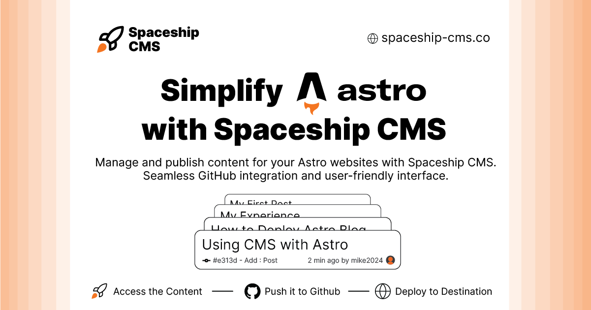

# Spaceship CMS (Work in Progress) 


Spaceship CMS is designed to simplify MDX content management for Astro websites. By integrating directly with GitHub repositories, Spaceship CMS offers a user-friendly interface and powerful features to streamline content creation, editing, and publishing.

## Features (_under development_)

- **GitHub Integration:** Seamlessly connect to your GitHub repositories.
- **Markdown Support:** Effortlessly manage MDX content.
- **Editor Collaboration:** Facilitate collaboration with multiple editors.
- **User-friendly Interface:** Experience a smooth and intuitive workflow.
- **Project Elevation:** Take your web projects to new heights.

## How it will Work

1. **Connect GitHub:** Link your GitHub account and select the repository for your Astro website.
2. **Create Content:** Use our intuitive markdown editor to create and edit MDX files effortlessly.
3. **Collaborate:** Add editors to your project for seamless collaboration and content management.
4. **Publish:** Commit and push changes directly from the editor to your GitHub repository for instant updates.

## Installation

1. Clone the repository:
    ```sh
    git clone https://github.com/areeburrub/spaceship-cms.git
    ```
2. Navigate to the project directory:
    ```sh
    cd spaceship-cms
    ```
3. Install dependencies:
    ```sh
    npm install -g pnpm 
    pnpm install
    ```
4. Start the development server:
    ```sh
    pnpm run dev
    ```

## Contributing

I welcome contributions to Spaceship CMS! If you have any suggestions, bug reports, or would like to contribute code, please email me at [contact@areeburrub.dev](mailto:contact@areeburrub.dev).

## License

This project is licensed under the Creative Commons Attribution-NonCommercial-ShareAlike 4.0 International License.

See the [LICENSE](LICENSE.md) file for details.

## Contact

For any questions or inquiries, please contact me at [contact@areeburrub.dev](mailto:contact@areeburrub.dev).
